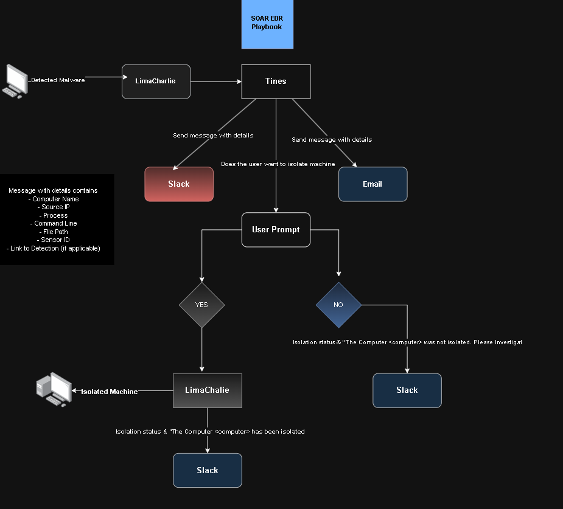

# SOAR-EDR

1. Introduction
2. Objective
3. Diagram
4. Installation of LimaCharlie
5. Integrate Limacharlie/Tines/Slack
6. Testing & Results
7. Challenges Faced

**EDR:**  EndPoint Detection and Response monitors and analyze endpoints for threats
**SOAR:  (**Security Orchestration, Automation and Response)
- Orchestration : Connects different tools together EDR + Firewall + threat intel
- Automation : Looks hash in virustotal, decides if it malicious
- Response : Isolate endpoint, Block IP, Send email / Slack alert

## Introduction

<aside>
🚨

SOAR(**Tines**)-EDR(**LimaCharlie**) 

LimaCharlie a cloud based EDR platform, deploying agents on endpoint to monitor activity, detect threats and take actions, extending its functionality by integrating with **Tines** allows execute automated workflow across multiple systems. This enables enrichment of alerts, conditional decision-making and automated communication such as notification and creating workspace on **slack** to get alerts instantly 

</aside>

## Objective

- Install & setup LimaCharlie
- Alerts, Creating Detection and Response rule
- Setup Slack and Tines
- Creating automated workflow

## Diagram

## Installation of LimaCharlie

- Browse to [limacharlies](https://limacharlie.io/) website and create a account
- Create a new organization

- After redirecting to Dashboard. Install and register endpoint agent head to > Installation Keys under Sensor Lists

- **Create Installation Key > Enter workspace name**
- After creating one copy the `Sensor Key` **Need it while installation**

- Navigate to workspace you created

- Download the executable file by scrolling down and download

- Navigate to Downloaded Folder in `Powershell` > `.\.exe -i (Sensor ID)` Copied earlier

- Successfully Installed `Limacharlie Agent`
- To confirm Launch `Service` and search for `LimaCharlie`

- Navigate to LimaCharlie web > Sensor List > `your-endpoint-device`

- **In sensor page is basically a central view of all endpoints running the sensors agent showing status, identity and allowing to manage and respond**

- Confirming Events > Processes/Timeline/Users

### Generating Alert

To create some alerts we’ll use a password recovery tool [`laZagne`](https://github.com/alessandroz/lazagne)to which we’ll use till the end of the project 

- Run it with powershell

- Click on copy event (save it for later)

### Creating Detection & Response Rule

- Head to Main page(Dashboard) > Automation > `D&R Rules` > Add Rule

- [LimaCharlie Rule](https://github.com/MyDFIR/SOAR-EDR-Project) By MYDFIR
- Now to test the rule scroll down to bottom click on target event, and paste the event we copied and click run test
- Run the `LaZagne` and navigate to detections and here we’ll see the alerts

## Integrating Limacharlie/Tines/Slack

## Slack

- Browse to slack website > Create a account > Create a Workspace > Add a channel `alerts`

## Tines

- Browse to Tines website  > Create an account > We’ll be directed to workspace, Clear the canvas and add Webhook from the left toolbar > Name it as `Retrieve Detection`

### Integrating Data

- Copy the `Webhook URL` to  and navigate to limacharlies `Outputs`
- Add `OUTPUT` > Detection > Tines

### Configure Output of Detection to Tines

- Name it and Paste the webhook URL

- Save Output

### Checking if the data is receiving on the end(Tines)

- Run once again `LaZagne` tool on host and `REFRESH SAMPLES`

- Its receiving

- Navigate back to Tines > Webhook > Events under events click `retrieve_detection` > `body` here we can see a detailed information of the event received from the endpoint

- We can confirm that we’re receiving data from EDR

### Credentials

- This allows automation workflows to access and control other systems
- In tines navigate back to stories > on top right, open the dropdown > Credentials > Slack > Paste the OAuth token

Follow this Documentation to setup [credentials](https://docs.n8n.io/integrations/builtin/credentials/slack/#using-api-access-token) 

- After creating the credentials, Add slack by clicking on left panel > Templates > search slack >  connect slack with workflow
- Copy the channel name of slack workflow paste under slacks `Channel/UserId`
- Under webhook > Events > Select event > `Retrieve Detection` > body,routing

- Copy the events you’d like to add in alerts message

> Connect it with webhook
> 

### Sending Email

- This will send a detailed message to mail as

On the left menu, Drag `Send Email` > Provide Email > Under body, Paste the copied event from slack

### Adding User-Prompt for Machine Isolation

- From the left panel > Tools > Drag Page > Create Page > Paste the events copied, add Boolean buttons > Connect with `webhook`

- Now click `NO` and Submit to add a condition value to it
- On the workflow canvas > Add Condition > Name `NO` > Under rules, add value > User Prompt > body > Isolate at the bottom we can see `Result:false` as we submitted no at the user prompt. This is the value we need for condition `NO`

- Set the `is equal to false`

- To receive the message of the condition no, we need to add another slack template > Paste the `Channel/UserID` , Under Message tab: Paste the copied event value of `hostname`

- We received alert on slack
- Do it same for `Yes` Condition > Set the `is equal to true`

### Isolating Sensor

- Now we’ve setup all the necessary things to get detailed message about events and for isolation but now we need something that isolate the machine based on the condition user selected to do so
- Left panel > Templates > `LimaCharlie` > isolated Server > rerun the event to get the sid value under URL > Add value > retrieve detection > routing > sid / or we can directly edit the `sid` value
- Copy the `Sensor ID` event value and paste it under `URL` > Method `POST` > Content type `JSON`

- Head back to limacharlie > `Access Management` > REST APT > Copy the `Org JWT` token

- Now navigate back to tines `Credentials` > New > Text > Enter Name > Paste the token under `Value` > Under domain > `*.limacharlie.io` this uses the credentials only from this site specified
- Connect the limacharlie
- Rerun the event to make sure the isolation is working > Under the page we created for conditional > Events > select event > `re-emit`

- Now the isolation is working and the machines has been isolated, we need isolation status to send a confirmation message over slack about the machines isolated
- Search `LimaCharlie` > `get isolation status` > change the sid value (paste the sensor id event value under URL) > Connect limacharlie
- Under isolation status > test > select recent event > get_isolation_status > body

- Add another slack template > Copy the slack template of the `NO` condition > Under message add value > `get_isolation_status` > body > at the bottom we can see the `isolation : true` > `is_isolated : true`

## Testing & Result

LaZange Tool:

**Email:**

**S**lack:

**Tines:**

**Slack:**

**LimaChar**lie:

## Challenges Faced:

- Integrating Tines(Credentials) with Slack
